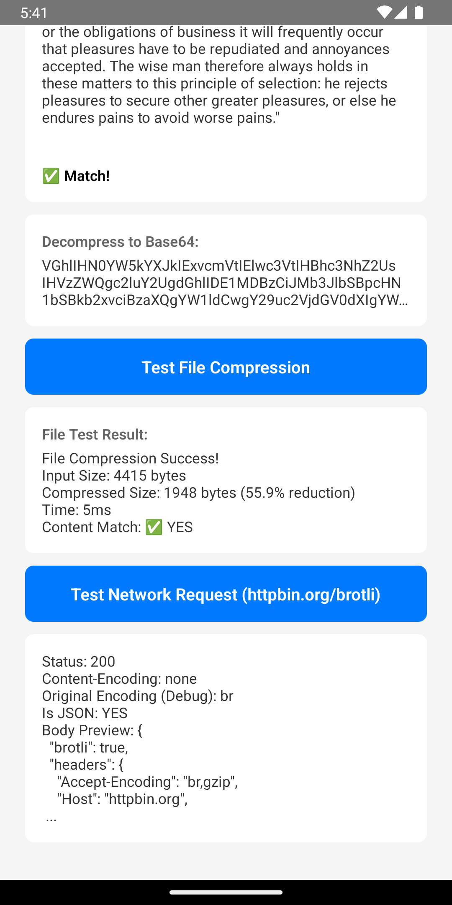
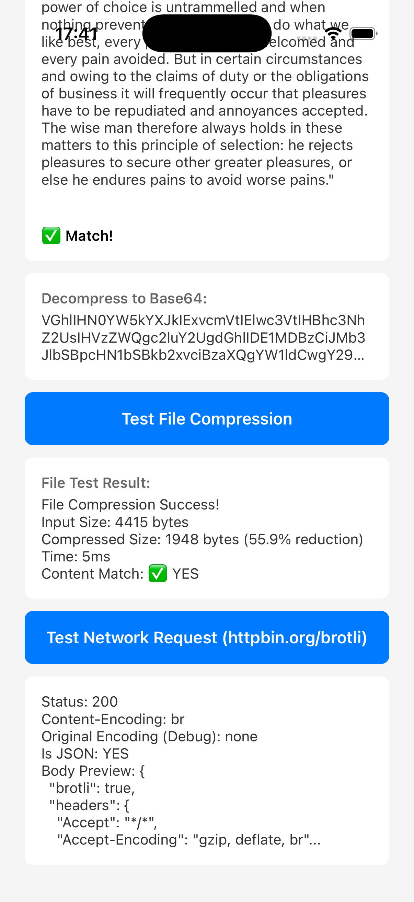

# react-native-brotli

Brotli compression/decompression for React Native — built with the **New Architecture** (Turbo Module).

| Platform | Compress/Decompress                                         | HTTP Interceptor           |
| -------- | ----------------------------------------------------------- | -------------------------- |
| Android  | JNI (Google Brotli C encoder) + `org.brotli` (Java decoder) | OkHttp `BrotliInterceptor` |
| iOS      | Google Brotli C encoder + Apple `compression` decoder API   | —                          |

### HTTP Interceptor

#### Android (Automatic)

The library automatically configures React Native's Android network stack to accept and decode `Content-Encoding: br` responses for `fetch`.

- No manual setup is required.

```ts
const response = await fetch('https://httpbin.org/brotli');
const body = await response.text();
```

If the interceptor handled Brotli, the response includes:

- `X-Original-Content-Encoding: br`

This debug header is added after the interceptor removes `Content-Encoding` from the decoded response.

#### iOS

iOS handles Brotli decoding through the OS networking stack (`NSURLSession`), so no custom interceptor is needed.

## Screenshots

| Android | iOS |
|---|---|
|  |  |

## Installation

```bash
npm install react-native-brotli
# or
yarn add react-native-brotli
```

### iOS

```bash
cd ios && pod install
```

### Android

No extra steps — Gradle dependencies are bundled.

## API

### `compress(data: string, quality?: number): Promise<string>`

Compress base64-encoded data using Brotli.

- `data` — Base64-encoded input
- `quality` — Compression quality `0–11` (default: `6`, applied on Android and iOS)
- **Returns** — Base64-encoded compressed data

```ts
import { compress } from 'react-native-brotli';

const compressed = await compress(btoa('Hello, Brotli!'), 6);
```

### `decompress(data: string): Promise<string>`

Decompress Brotli-compressed base64 data to a UTF-8 string.

```ts
import { decompress } from 'react-native-brotli';

const text = await decompress(compressed);
// => "Hello, Brotli!"
```

### `decompressToBase64(data: string): Promise<string>`

Decompress Brotli-compressed base64 data, returning the result as base64.

```ts
import { decompressToBase64 } from 'react-native-brotli';

const base64Result = await decompressToBase64(compressed);
```

### `compressFile(input: string, output: string, quality?: number): Promise<void>`

Compress a file using Brotli streaming (low memory usage).

- `input` — Absolute path to input file
- `output` — Absolute path to output file
- `quality` — Compression quality `0–11` (default: `6`, applied on Android and iOS)

```ts
import { compressFile } from 'react-native-brotli';

await compressFile('/path/to/input.txt', '/path/to/output.br');
```

### `decompressFile(input: string, output: string): Promise<void>`

Decompress a Brotli file using streaming.

- `input` — Absolute path to compressed file
- `output` — Absolute path to output file

```ts
import { decompressFile } from 'react-native-brotli';

await decompressFile('/path/to/input.br', '/path/to/output.txt');
```

## Requirements

- React Native **0.76+** (New Architecture)
- iOS **13.0+**
- Android **minSdk 24+**

## License

MIT
